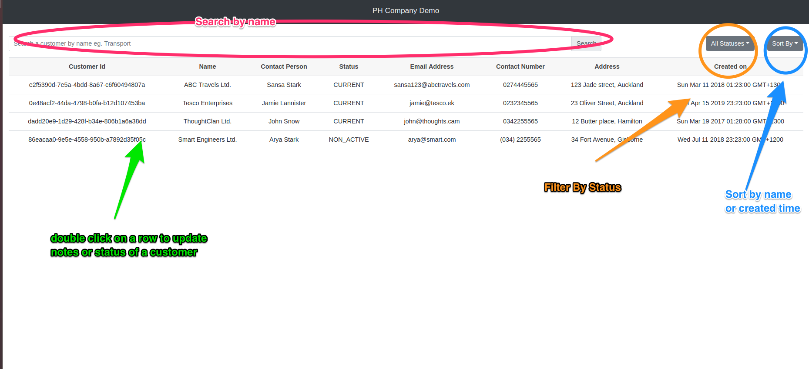
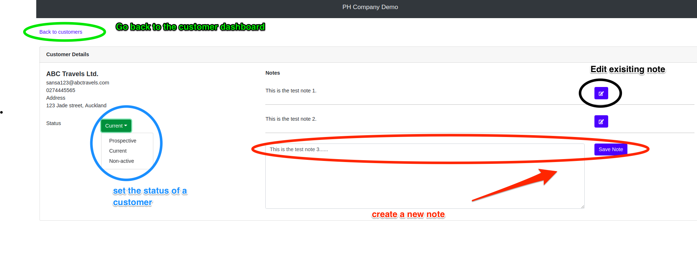

# Demo App - Frontend

## Overview 
Following technologies are used to develop this project -
* React
* ES6
* Redux
* NPM
* Bootstrap

## Build
* Please make sure that Node.js 8.x or higher is installed on your system.
* Go to the folder `demoappclient` on your terminal
* Execute `npm install` to install the dependencies
* Execute `npm start &` to start the application
* Webapp should be hosted on http://localhost:3000/ now.

## Screenshots

 